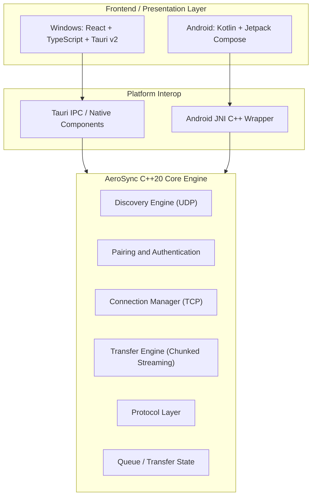

# AeroSync — High-Speed Cross-Platform File Transfer

<div align="center">


### High-speed peer-to-peer file sharing between Windows, Linux, and Android over local Wi-Fi or Hotspot.

**Zero Cloud • Zero Compression • Direct Local Transfer**

---

[](https://github.com/Atulsain011/Aero_sync/releases/latest)
[](https://github.com/Atulsain011/Aero_sync/releases)
[](core/)
[](platform/windows/desktop_tauri)
[](LICENSE)

---

## 🚀 Downloads

| Platform | Package | Download Link | Version |
| :--- | :--- | :--- | :--- |
| **Linux — AppImage (Recommended)** | `AeroSync-Linux-x86_64.AppImage` | [**Download Linux AppImage (Recommended)**](https://github.com/Atulsain011/Aero_sync/releases/download/v1.0.8/AeroSync-Linux-x86_64.AppImage) | `v1.0.8` |
| **Linux — Debian/Ubuntu (.deb)** | `aerosync_1.0.8_amd64.deb` | [**Download Linux DEB Package**](https://github.com/Atulsain011/Aero_sync/releases/download/v1.0.8/aerosync_1.0.8_amd64.deb) | `v1.0.8` |
| **Windows (Installer)** | `AeroSync-Setup-v1.0.8.exe` | [**Download Windows Installer (Recommended)**](https://github.com/Atulsain011/Aero_sync/releases/download/v1.0.8/AeroSync-Setup-v1.0.8.exe) | `v1.0.8` |
| **Windows (Portable)** | `AeroSync-Windows-Portable.zip` | [**Download Windows Portable (.zip)**](https://github.com/Atulsain011/Aero_sync/releases/download/v1.0.8/AeroSync-Windows-Portable.zip) | `v1.0.8` |
| **Windows (Standalone)** | `AeroSync.exe` | [**Download Windows Executable**](https://github.com/Atulsain011/Aero_sync/releases/download/v1.0.8/AeroSync.exe) | `v1.0.8` |
| **Windows (1-Click Launcher)** | `Start_AeroSync_Desktop.bat` | [**Download Windows 1-Click Launcher**](https://github.com/Atulsain011/Aero_sync/releases/download/v1.0.8/Start_AeroSync_Desktop.bat) | `v1.0.8` |
| **Android (APK)** | `AeroSync.apk` | [**Download Android APK**](https://github.com/Atulsain011/Aero_sync/releases/download/v1.0.8/AeroSync.apk) | `v1.0.8` |
| **All Releases** | GitHub Releases | [**Browse All Releases**](https://github.com/Atulsain011/Aero_sync/releases) | `Latest` |

<br>

[-AeroSync-FCC624?style=for-the-badge&logo=linux&logoColor=black)](https://github.com/Atulsain011/Aero_sync/releases/download/v1.0.8/AeroSync-Linux-x86_64.AppImage)
[-AeroSync-A81D33?style=for-the-badge&logo=debian&logoColor=white)](https://github.com/Atulsain011/Aero_sync/releases/download/v1.0.8/aerosync_1.0.8_amd64.deb)
[](https://github.com/Atulsain011/Aero_sync/releases/download/v1.0.8/AeroSync-Setup-v1.0.8.exe)
[](https://github.com/Atulsain011/Aero_sync/releases/download/v1.0.8/AeroSync.apk)

</div>

---

## 📖 Overview

**AeroSync** is a peer-to-peer file transfer application designed for fast file sharing between Windows PCs and Android devices over local Wi-Fi networks or mobile hotspots.

Files are transferred directly between connected devices without requiring cloud storage or an external file-transfer server.

The project combines a native C++20 transfer engine with platform-specific interfaces for Windows and Android.

```text
+-------------------+          Local Wi-Fi / Hotspot          +-------------------+
|                   | <=====================================> |                   |
|    Windows PC     |           Direct File Transfer          |   Android Device  |
|                   |                                         |                   |
| Tauri + React UI  |                                         | Jetpack Compose   |
| C++20 Core Engine |                                         | JNI + C++ Engine  |
+-------------------+                                         +-------------------+
```

---

## 💡 Why AeroSync?

Traditional file-transfer methods can involve cloud uploads, internet bandwidth, Bluetooth limitations, USB cables, or third-party services.

AeroSync is designed around direct local communication:

* **No cloud storage required**
* **No external transfer server required for local transfers**
* **Works over local Wi-Fi**
* **Works through mobile hotspots**
* **Designed for large files and folders**
* **Direct device-to-device communication**
* **Native C++ transfer engine**
* **Windows and Android support**

---

## ✨ Key Features

### ⚡ High-Speed Local Transfer
AeroSync is optimized for high-throughput file transfers over local networks.

It is suitable for:
* Large videos & Movies
* Archives & ZIPs
* Software packages & ISOs
* Backups & System images
* Documents & Photos
* Multiple files & Deep folder hierarchies

*Actual transfer performance depends on Wi-Fi hardware, network configuration, device capabilities, storage performance, CPU utilization, network congestion, and transfer direction.*

### 🔎 Automatic Device Discovery
Nearby AeroSync devices can be discovered over the local network using network discovery mechanisms such as UDP-based discovery, eliminating manual IP-address configuration.

### 🔐 Device Pairing
AeroSync provides secure device pairing before allowing transfers. Pairing mechanisms include:
* PIN-based pairing
* User confirmation prompts
* QR-based connection

### 📁 File and Folder Transfer
AeroSync supports transferring:
* Individual files
* Multiple files in bulk
* Large multi-gigabyte files
* Nested directory structures
* Transfer integrity verification using chunked checksums

### 🖥️ Windows Desktop Application
The Windows client uses:
* React 18
* TypeScript
* Tauri v2
* Rust runtime
* Native C++20 components

### 📱 Android Application
The Android client uses:
* Kotlin
* Jetpack Compose
* Material 3
* JNI (Java Native Interface)
* Native C++20 components

### 🌐 Local Network Operation
AeroSync is designed to work without requiring an internet connection for local transfers. Both devices can communicate through:
* The same Wi-Fi network
* A phone mobile hotspot
* A local access point / switch

---

## 🔄 Transfer Queue & State Synchronization

AeroSync includes real-time transfer queue management. A transfer transitions through the following states:

```text
QUEUED ───► READY ───► TRANSFERRING ───► COMPLETED
                             │
                             ├───► CANCELLED
                             └───► FAILED
```

Each transfer is tracked with a unique transfer ID so that Android and Windows maintain consistent state in real time.

### Transfer Cancellation Synchronization
When a transfer is cancelled from either device, the cancellation event is instantly synchronized with the connected peer:

```text
Android                                  Windows
   │                                        │
   │─────── TRANSFER_CANCEL_EVENT ─────────►│
   │                                        │
[State: Cancelled]                      [State: Cancelled]
```

The active file stream is cleanly aborted on both endpoints and the queue state updates immediately.

---

## 🏗️ System Architecture



---

## 🛠️ Technology Stack

| Component | Technology |
| :--- | :--- |
| **Windows UI** | React 18, TypeScript |
| **Desktop Framework** | Tauri v2 |
| **Desktop Runtime** | Rust |
| **Core Engine** | C++20 |
| **Android UI** | Kotlin, Jetpack Compose, Material 3 |
| **Android Native Layer** | JNI + C++20 |
| **Network Communication** | TCP / UDP Sockets |
| **Build System** | CMake, Gradle, Cargo, Ninja |
| **Android Build** | Gradle 8.10+, NDK 25.1+ |
| **Windows Build** | CMake + Tauri + NSIS |
| **Version Control** | Git |

---

## 🌍 Future: Remote File Transfer (Roadmap)

The long-term goal of AeroSync is to allow users to send files between devices across different networks over the internet:

```text
Android (Jaipur) ══════════════ [Internet P2P] ══════════════ Windows (Delhi)
```

### Planned Remote Architecture:

```text
                  Internet
                     │
              ┌──────▼──────┐
              │ Signaling   │
              │   Server    │
              └──────┬──────┘
                     │
               Connection Setup
                     │
              NAT Traversal (STUN/TURN)
                     │
          ┌──────────┴──────────┐
          │                     │
     ┌────▼────┐           ┌────▼────┐
     │ Sender  │◄─────────►│ Receiver│
     └─────────┘    P2P    └─────────┘
```

The planned remote-transfer system will feature:
* **Signaling Server**: Session exchange, authentication, and endpoint negotiation.
* **STUN / NAT Traversal**: Direct peer-to-peer punching through home routers and firewalls.
* **TURN Relay Fallback**: Guaranteed delivery even on symmetric NATs.
* **Resumable Transfers**: Splitting large 10GB+ files into hash-verified chunks with resume capability upon network disruption.

> [!NOTE]
> *Remote internet transfer is a planned capability on the project roadmap. The current release is focused on local Wi-Fi and hotspot transfers.*

---

## 🚀 Quick Start Guide

### Linux

#### System Requirements
- **Architecture**: 64-bit x86_64 (`amd64`)
- **Supported Distributions**: Ubuntu 22.04+, Debian 12+, Fedora 38+, Linux Mint 21+, Arch Linux, Manjaro, openSUSE Leap/Tumbleweed
- **Display Runtime**: WebKitGTK 4.1 (`libwebkit2gtk-4.1-0`) & GTK 3 (`libgtk-3-0`)

#### Linux — AppImage (Recommended)
Universal self-contained executable for Ubuntu, Debian, Fedora, Arch Linux, openSUSE, and other distributions:
1. Download **`AeroSync-Linux-x86_64.AppImage`** from [GitHub Releases](https://github.com/Atulsain011/Aero_sync/releases).
2. Double-click to launch (or right-click -> Properties -> *Allow executing file as program* if your distribution requires it).
3. AeroSync opens, automatically starts the bundled daemon, discovers real devices on your Wi-Fi or hotspot, and is immediately ready to send and receive files!

#### Linux — Debian/Ubuntu (.deb)
Native package installer for Debian, Ubuntu, Kubuntu, and Linux Mint:
1. Download **`aerosync_1.0.8_amd64.deb`** from [GitHub Releases](https://github.com/Atulsain011/Aero_sync/releases).
2. Double-click the downloaded file in your browser or file manager and click **Install** in your system Software Center / App Center.
3. Open **AeroSync** from your desktop **Application Launcher** or **Applications Menu**.

*(CLI option: `sudo apt install ./aerosync_1.0.8_amd64.deb`)*

### Windows
#### Recommended: Installer
1. Download [**`AeroSync-Setup-v1.0.8.exe`**](https://github.com/Atulsain011/Aero_sync/releases/download/v1.0.8/AeroSync-Setup-v1.0.8.exe) from GitHub Releases (`v1.0.8`).
2. Run the installer and complete setup.
3. Launch AeroSync from the Desktop shortcut or Start Menu.
4. Allow network access through Windows Firewall if prompted.
5. Connect your Windows PC, Linux machine, and Android device to the same Wi-Fi or hotspot.

#### Portable Version
1. Download [**`AeroSync-Windows-Portable.zip`**](https://github.com/Atulsain011/Aero_sync/releases/download/v1.0.8/AeroSync-Windows-Portable.zip).
2. Extract the ZIP archive.
3. Run `AeroSync.exe`.

### Android
1. Download [**`AeroSync.apk`**](https://github.com/Atulsain011/Aero_sync/releases/download/v1.0.8/AeroSync.apk).
2. Tap the APK to install (*enable "Install unknown apps" if prompted*).
3. Grant requested permissions (Nearby devices & storage access).
4. Open AeroSync on both devices, discover, pair, and transfer!

---

## 💻 Building From Source

### Prerequisites

#### Windows
* Windows 10 or Windows 11 (x64)
* CMake 3.22+ and Ninja
* MSVC 2022+ or Clang/LLVM
* Rust 1.80+ (`rustup default stable`)
* Node.js 18+ and npm

#### Android
* Android Studio Hedgehog or newer
* Android SDK (API 34)
* Android NDK 25.1.8937393
* JDK 17+
* Gradle 8.10+

---

### Linux AppImage & DEB Package Build

```bash
# Make scripts executable
chmod +x build_linux.sh package_linux.sh

# Run the complete Linux production build pipeline (.AppImage & .deb)
./build_linux.sh
```

Generated Linux packages will be located at:
```text
release/AeroSync-Linux-x86_64.AppImage   # Linux — AppImage (Recommended)
release/aerosync_1.0.8_amd64.deb        # Linux — Debian/Ubuntu (.deb)
```

#### Running & Installing on Linux

> **Linux System Requirement**: AeroSync uses WebKitGTK 4.1 (`libwebkit2gtk-4.1-0`) and GTK 3 for desktop rendering.

- **Debian / Ubuntu / Kubuntu / Mint Package (`.deb`) — Recommended for Debian/Ubuntu**:
  Installs AeroSync, the native daemon, menu launcher, and automatically resolves all required runtime dependencies (including `libwebkit2gtk-4.1-0`).
  Double-click `aerosync_1.0.8_amd64.deb` to install via Ubuntu App Center or KDE Discover.
  
  Or via terminal:
  ```bash
  sudo apt install ./aerosync_1.0.8_amd64.deb
  ```

- **AppImage (Single-File Executable Container)**:
  Bundles the AeroSync desktop client and native C++ daemon into a genuine Type 2 ELF container. It requires `libwebkit2gtk-4.1-0` and `libgtk-3-0` on the host system.
  ```bash
  chmod +x AeroSync-Linux-x86_64.AppImage
  ./AeroSync-Linux-x86_64.AppImage
  ```
  *(If your distribution lacks WebKitGTK 4.1, install it via `sudo apt install libwebkit2gtk-4.1-0` or your distribution package manager).*

---

### Windows Desktop & Installer Build

```powershell
# Unified build and NSIS installer packaging script
powershell -ExecutionPolicy Bypass -File .\build_desktop_and_installer.ps1
```

---

### Android Build

```powershell
cd platform/android
.\gradlew.bat assembleDebug
```

The generated APK will be at:
```text
platform/android/app/build/outputs/apk/debug/app-debug.apk
```

---

## 📂 Repository Structure

```text
AeroSync/
├── core/                               # C++20 Core Engine
│   ├── include/aerosync/               # Public C++ headers
│   └── src/                            # Transfer & discovery logic
├── proto/                              # Protobuf specifications
│   └── aerosync.proto
├── platform/
│   ├── windows/                        # Windows Desktop
│   │   ├── desktop_tauri/              # Tauri v2 + React Frontend & Rust Backend
│   │   ├── assets/                     # Application Icons & Resources
│   │   └── src/
│   └── android/                        # Android App
│       └── app/
│           └── src/main/               # Jetpack Compose UI & JNI bindings
├── release/                            # Built release binaries & setup packages
├── build_desktop_and_installer.ps1     # Automated Windows build script
├── build_all.ps1                       # Unified build script
├── LICENSE                             # MIT License
└── README.md                           # Documentation
```

---

## ⚡ Performance

AeroSync is designed for high-speed local-network file transfers.

| Test | Network | File Size | Direction | Speed |
| :--- | :--- | :--- | :--- | :--- |
| 1 | Wi-Fi 5 / Hotspot | 1 GB | Android → Windows | ~35–55 MB/s |
| 2 | Wi-Fi 5 / Hotspot | 1 GB | Windows → Android | ~35–55 MB/s |
| 3 | Wi-Fi 6 (5GHz) | 5 GB | Android → Windows | ~75–110 MB/s |
| 4 | Wi-Fi 6 (5GHz) | 5 GB | Windows → Android | ~75–110 MB/s |

*Speeds vary based on Wi-Fi generation, signal strength, flash storage write speeds, and device thermal throttling.*

---

## 🎨 Branding & Icons

AeroSync v1.0.8 uses standardized branding across all platforms:
* **Background**: Sleek dark navy squircle (`#0F172A`)
* **Glyph**: Vibrant glowing cyan/blue cloud with bi-directional transfer arrows
* **Transparency**: 100% transparent corners for desktop, taskbar, start menu, and launcher icons.
* **Consistency**: Identical branding across Android launcher, Android APK, Windows EXE, Windows Installer, taskbar, and documentation.

---

## 🗺️ Project Roadmap

### Current (v1.0.8)
- [x] Windows application (Tauri v2 + React)
- [x] Linux application (AppImage container & DEB package with system launcher)
- [x] Android application (Jetpack Compose + Material 3)
- [x] Local Wi-Fi & Mobile Hotspot transfer
- [x] UDP automatic device discovery
- [x] Secure PIN pairing
- [x] Multiple file & folder transfers
- [x] Real-time transfer queue & live ETA/progress
- [x] Instant bi-directional transfer cancellation
- [x] Windows NSIS setup installer & Portable ZIP
- [x] Linux system application launcher integration & native desktop actions
- [x] Android APK release automation
- [x] Standardized application branding & multi-res icons

### Planned
- [ ] Remote cross-network transfers
- [ ] Signaling server architecture
- [ ] STUN / TURN NAT traversal integration
- [ ] Resumable remote transfers with chunk verification
- [ ] QR-code based remote transfer pairing
- [ ] End-to-end encrypted remote sockets

---

## 📄 License

This project is licensed under the **MIT License**. See [LICENSE](LICENSE) for details.

---

<div align="center">

### AeroSync — Fast. Direct. Private.

Crafted with ❤️ by [Atul Kumar](https://github.com/Atulsain011)

⭐ If you find AeroSync useful, please consider giving the repository a star!

</div>
