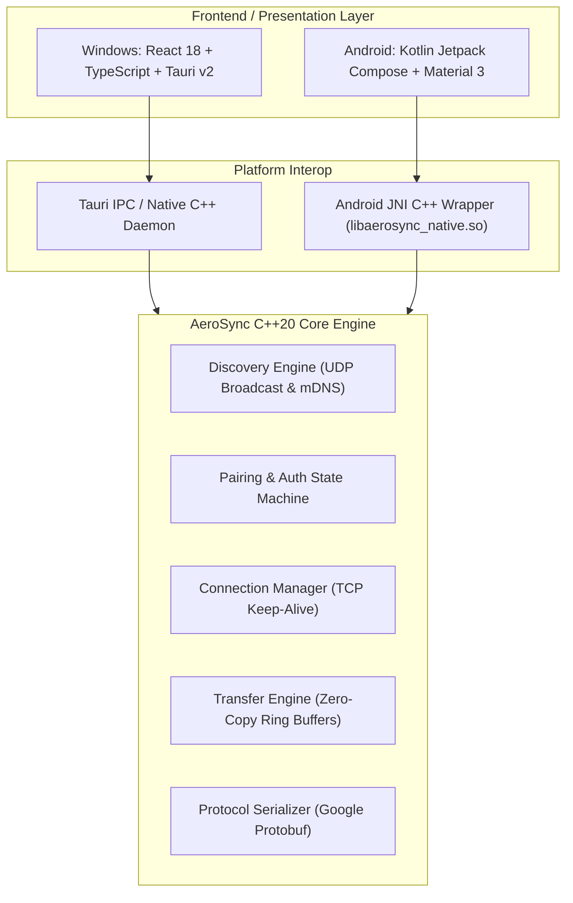

# ⚡ AeroSync — Next-Gen High-Speed Cross-Platform File Transfer

<div align="center">


### **Lightning-fast, peer-to-peer file sharing between Windows & Android over local Wi-Fi / Hotspot.**
**Zero Cloud • Zero Compression • Zero Limits • 100+ MB/s Real-World Throughput**

---

[](https://github.com/Atulsain011/AeroSync/releases/latest)
[](https://github.com/Atulsain011/AeroSync/releases)
[](core/)
[](platform/windows/desktop_tauri)
[](LICENSE)

---

### 📥 **Direct Download Links**

| Platform | Binary | Direct Download Link | Version |
| :--- | :--- | :--- | :--- |
| 🪟 **Windows (10/11 x64)** | **`AeroSync.exe`** | [⬇️ **Download Windows App (.exe)**](https://github.com/Atulsain011/AeroSync/releases/latest/download/AeroSync.exe) | `v1.0.0` |
| 🤖 **Android (8.0+)** | **`AeroSync.apk`** | [📱 **Download Android APK (.apk)**](https://github.com/Atulsain011/AeroSync/releases/latest/download/AeroSync.apk) | `v1.0.0` |
| 📦 **All Releases** | **Releases Hub** | [🔗 **Browse GitHub Releases**](https://github.com/Atulsain011/AeroSync/releases) | `Latest` |

<br/>

[](https://github.com/Atulsain011/AeroSync/releases/latest/download/AeroSync.exe)
&nbsp;&nbsp;
[](https://github.com/Atulsain011/AeroSync/releases/latest/download/AeroSync.apk)

</div>

---

## 🌟 Why AeroSync?

Traditional file transfer tools rely on slow Bluetooth, cloud servers that throttle upload bandwidth, or ad-ridden proprietary utilities. **AeroSync** connects your devices directly over your local Wi-Fi or mobile hotspot using a **high-performance C++20 asynchronous socket engine** with zero-copy buffer streaming and instant peer discovery.

```
+-------------------+           Local Wi-Fi / Hotspot           +-------------------+
|   Windows PC      | <=======================================> |   Android Device  |
| (Tauri 2 + C++20) |         Direct Zero-Copy Stream           | (Compose + JNI)   |
|   100+ MB/s       |          (UDP/TCP Socket Engine)          |   100+ MB/s       |
+-------------------+                                           +-------------------+
```

---

## ✨ Key Features

- 🚀 **Blazing High Speed (100+ MB/s)**: Optimized zero-copy buffer architecture transfers 4K videos, heavy ISOs, game folders, and thousands of photos in seconds.
- 📡 **Zero-Config Instant Discovery**: Discovers nearby Windows PCs and Android devices on the LAN/Hotspot automatically via UDP beacon broadcasts and mDNS (<50ms discovery time).
- 🔒 **Secure End-to-End Pairing**: One-time 6-digit PIN handshake or instant QR code connection prevents unauthorized access on shared Wi-Fi networks.
- 📁 **Batch File & Deep Directory Transfer**: Send individual files, large multi-gigabyte archives, or nested folder structures with integrity checksums (SHA-256 / CRC32).
- 💻 **Modern Glassmorphic Windows UI**: Ultra-sleek, lightweight UI built with React 18, TypeScript, Tailwind/Vanilla CSS tokens, and Tauri v2 (under 5MB executable).
- 📱 **Native Jetpack Compose Android Client**: Beautiful Material 3 UI with dark mode, real-time transfer progress bars, speed gauges, and background service support.
- 🛡️ **Firewall & Hotspot Ready**: Auto-configures inbound Windows Firewall rules and seamlessly works across Android Wi-Fi Hotspots without internet.

---

## 🏗️ System Architecture



---

## 🚀 Quick Start Guide

### 🪟 Windows Setup
1. Download [**`AeroSync.exe`**](https://github.com/Atulsain011/AeroSync/releases/latest/download/AeroSync.exe).
2. Run `AeroSync.exe` (or launch via `Start_AeroSync_Desktop.bat`).
3. If prompted by Windows Defender SmartScreen, click **More Info** -> **Run anyway**.
4. Allow Windows Firewall access on Private networks when prompted.

### 🤖 Android Setup
1. Download [**`AeroSync.apk`**](https://github.com/Atulsain011/AeroSync/releases/latest/download/AeroSync.apk).
2. Open the `.apk` on your Android device and enable **Install Unknown Apps** for your browser/file manager if requested.
3. Grant **Nearby Devices**, **Wi-Fi**, and **Storage/Media** permissions.
4. Connect both your PC and Phone to the same Wi-Fi network (or connect PC to your Phone's Hotspot).
5. Your devices will appear automatically in the radar view! Tap to pair and start transferring.

---

## 🛠️ Building From Source

### Prerequisites
- **Windows**: Clang / LLVM (or MSVC 2022+), CMake 3.22+, Ninja, Rust 1.80+ (`cargo`), Node.js 18+ (`npm`)
- **Android**: Android SDK (API 34), NDK (25.1+), JDK 17+, Gradle 8.10+

### Unified 1-Click Build (Windows + Android)
Run the automated build script in PowerShell:
```powershell
.\build_all.ps1
```

### Manual Individual Builds

#### 1. Windows Native Daemon & C++ Core
```powershell
cmake -B build_windows -S platform/windows -G "Ninja" -DCMAKE_BUILD_TYPE=Release
cmake --build build_windows
```

#### 2. Windows Tauri + React Client
```powershell
cd platform/windows/desktop_tauri
npm install
npm run build
cargo build --release
```

#### 3. Android Native APK
```powershell
cd platform/android
./gradlew assembleDebug
```
The compiled APK will be generated at:
`platform/android/app/build/outputs/apk/debug/app-debug.apk`

---

## 📂 Repository Structure

```
AeroSync/
├── core/                       # Cross-Platform C++20 Core Engine
│   ├── include/aerosync/       # Header definitions (Discovery, Transfer, Pairing, Sockets)
│   └── src/                    # Engine implementation (Zero-copy streaming, Protocol)
├── proto/                      # Protobuf frame schemas (aerosync.proto)
├── platform/
│   ├── windows/                # Windows Native & Desktop Implementations
│   │   ├── desktop_tauri/      # Tauri v2 + React 18 + TypeScript GUI App
│   │   ├── src/                # Windows daemon & window managers
│   │   └── installer_firewall_rule.ps1  # Automated firewall rule configurator
│   └── android/                # Android Jetpack Compose Native Mobile App
│       ├── app/src/main/cpp/   # JNI C++ Bridge (native_bridge.cpp)
│       └── app/src/main/java/  # Kotlin UI, ViewModels, Room DB & Services
├── tests/                      # Automated test suite & multi-gigabit throughput benchmark
├── build_all.ps1               # Complete unified build pipeline
└── Start_AeroSync_Desktop.bat  # 1-Click Windows desktop launcher
```

---

## 🔒 Security & Privacy

- **No Remote Servers**: Transfers remain 100% peer-to-peer over your local network. No file metadata, logs, or chunk contents ever touch an external cloud server.
- **PIN Pairing Protection**: Unrecognized devices cannot initiate file transfers without user verification.
- **Data Integrity**: Every transferred chunk is verified with real-time rolling checksums to guarantee 0% corruption.

---

## 📄 License

This project is licensed under the **MIT License** — see the [LICENSE](LICENSE) file for details.

---

<div align="center">

Crafted with ❤️ by [**Atul (Atulsain011)**](https://github.com/Atulsain011)

⭐ **Star this repository if you find AeroSync useful!**

</div>
