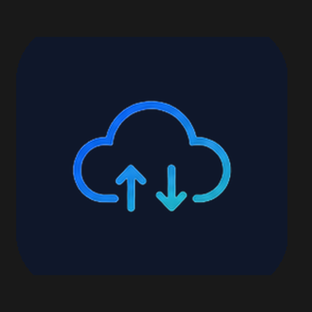
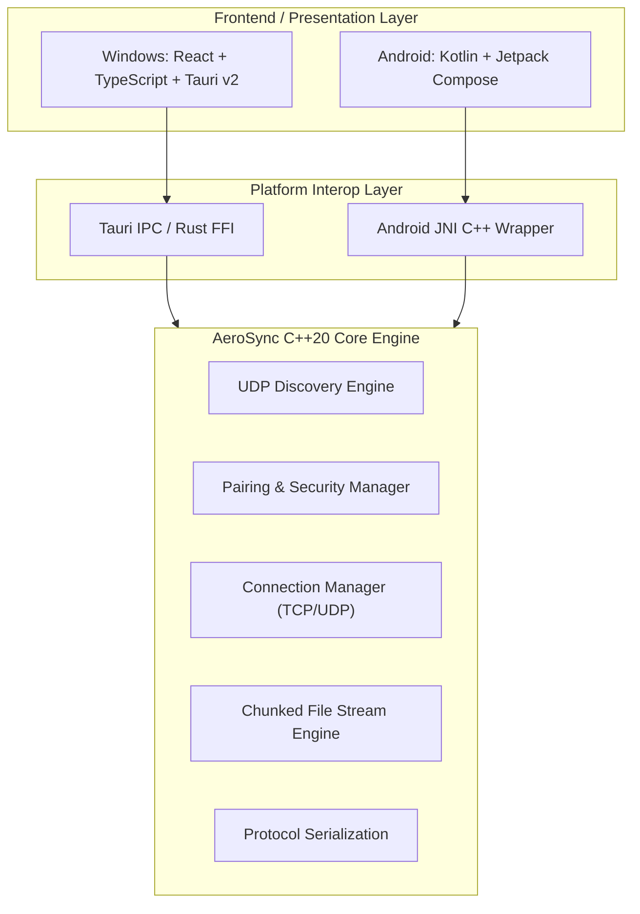

# AeroSync — Ultra-Fast Cross-Platform File Transfer

<div align="center">



### Blazing fast peer-to-peer file sharing between Windows and Android over local Wi-Fi or Hotspot.

**Zero Cloud • Zero Compression • Direct Local Transfer • Maximum Network Throughput**

---

[](https://github.com/Atulsain011/Aerosync/releases/latest)
[](https://github.com/Atulsain011/Aerosync/releases)
[](core/)
[](platform/windows/desktop_tauri)
[](LICENSE)

---

### 🚀 Direct Downloads (v1.0.6)

| Platform | Package | Download Link | Version |
| :--- | :--- | :--- | :--- |
| **Windows (Installer)** | `AeroSync-Setup-v1.0.6.exe` | [**Download Windows Installer (Recommended)**](https://github.com/Atulsain011/Aerosync/releases/download/v1.0.6/AeroSync-Setup-v1.0.6.exe) | `v1.0.6` |
| **Windows (Standalone)** | `AeroSync.exe` | [Download Windows Executable](https://github.com/Atulsain011/Aerosync/releases/download/v1.0.6/AeroSync.exe) | `v1.0.6` |
| **Windows (Portable)** | `AeroSync-Windows-Portable.zip` | [Download Windows Portable (.zip)](https://github.com/Atulsain011/Aerosync/releases/download/v1.0.6/AeroSync-Windows-Portable.zip) | `v1.0.6` |
| **Android (8.0+)** | `AeroSync.apk` | [**Download Android APK**](https://github.com/Atulsain011/Aerosync/releases/download/v1.0.6/AeroSync.apk) | `v1.0.6` |
| **All Releases** | GitHub Releases | [Browse All Releases](https://github.com/Atulsain011/Aerosync/releases) | `Latest` |

<br>

[](https://github.com/Atulsain011/Aerosync/releases/download/v1.0.6/AeroSync-Setup-v1.0.6.exe)
[](https://github.com/Atulsain011/Aerosync/releases/download/v1.0.6/AeroSync.apk)

</div>

---

## 📖 Overview

**AeroSync** is a high-performance, cross-platform file transfer application built to transfer large files and folders between Windows PCs and Android devices at the physical limits of your local Wi-Fi or mobile hotspot.

By establishing direct peer-to-peer TCP/UDP sockets on the local network, AeroSync achieves maximum throughput without uploading bytes to third-party cloud servers or consuming mobile internet quota.

```text
+-------------------+          Local Wi-Fi / Hotspot          +-------------------+
|                   | <=====================================> |                   |
|    Windows PC     |           Direct Peer-to-Peer           |   Android Device  |
|                   |              File Transfer              |                   |
| Tauri v2 + React  |                                         | Jetpack Compose   |
| C++20 Core Engine |                                         | JNI + C++ Engine  |
+-------------------+                                         +-------------------+
```

---

## ✨ Key Features

* **⚡ Ultra High-Speed Transfers**: Direct streaming over TCP sockets saturated to network hardware capacity. Ideal for 4K videos, game backups, ISO images, and directory trees.
* **🔒 100% Local & Private**: No cloud accounts, no third-party servers, no data tracking. File data never leaves your local area network.
* **📡 Zero-Config Device Discovery**: UDP broadcast beaconing instantly detects nearby AeroSync devices on the local subnet without requiring manual configuration.
* **🎯 Direct IP Connection**: Fallback manual IP entry mode with port specification for complex subnets or AP-isolated guest networks.
* **📁 Full Folder & Multi-File Support**: Seamlessly send multiple individual files or deep directory structures with full file attributes intact.
* **⏱️ Real-Time Bi-Directional Sync**: Live transfer speeds, ETA, interactive transfer progress rings, and instant cancellation synchronization between sender and receiver.
* **📱 Adaptive Responsive Layouts**: Sleek modern dark mode UI built with Jetpack Compose (Android) and React/TypeScript (Windows) that renders consistently across all screen sizes and resolutions.

---

## 🏗️ System Architecture



---

## 🛠️ Technology Stack

| Layer | Windows Desktop | Android Mobile |
| :--- | :--- | :--- |
| **UI Framework** | React 18, TypeScript, TailwindCSS/Vanilla CSS | Kotlin, Jetpack Compose, Material 3 |
| **Desktop / App Shell** | Tauri v2 (Rust runtime) | Android SDK (API 26-34) |
| **Core Transfer Engine** | C++20 Native Engine | C++20 Native Engine via JNI |
| **Networking** | Asynchronous TCP Streams + UDP Broadcast | Asynchronous TCP Sockets + Multicast/UDP |
| **Build Tools** | CMake, Ninja, Cargo, Vite, NSIS | Gradle 8.10+, Android NDK 25.1+, CMake |

---

## 🚀 Quick Start Guide

### Windows Installation

1. Download [`AeroSync-Setup-v1.0.6.exe`](https://github.com/Atulsain011/Aerosync/releases/download/v1.0.6/AeroSync-Setup-v1.0.6.exe) from the Releases page.
2. Run the installer and complete the setup.
3. Allow AeroSync through the Windows Firewall prompt when first launched.
4. Ensure both your Windows PC and Android device are connected to the same Wi-Fi network or Mobile Hotspot.

### Android Installation

1. Download [`AeroSync.apk`](https://github.com/Atulsain011/Aerosync/releases/download/v1.0.6/AeroSync.apk) onto your Android device.
2. Tap the downloaded APK to install (enable *"Install unknown apps"* in Android settings if prompted).
3. Grant necessary permissions (Nearby Devices / Local Network and Storage Access).
4. Launch AeroSync on both devices — your devices will automatically discover each other in seconds!

---

## 💻 Building From Source

### Prerequisites

* **Windows**:
  * Windows 10/11 (x64)
  * CMake 3.22+ and Ninja
  * MSVC v143 (Visual Studio 2022) or Clang/LLVM
  * Rust 1.80+ (`rustup default stable`)
  * Node.js 18+ and npm
* **Android**:
  * Android Studio Hedgehog or newer
  * Android SDK (API 34)
  * Android NDK 25.1.8937393
  * JDK 17+

### 1. Build Windows Desktop & Installer

```powershell
# Run the automated build and packaging script
powershell -ExecutionPolicy Bypass -File .\build_desktop_and_installer.ps1
```

This compiles:
* The React frontend bundle
* The native C++20 core engine
* The Tauri Rust release executable (`release/AeroSync.exe`)
* The complete NSIS Windows Setup Installer (`release/AeroSync-Setup-v1.0.6.exe`)

### 2. Build Android APK

```powershell
cd platform/android
.\gradlew.bat assembleDebug
```

The compiled APK will be located at:
```text
platform/android/app/build/outputs/apk/debug/app-debug.apk
```

---

## 📂 Repository Structure

```text
AeroSync/
├── core/                               # C++20 Core Transfer & Discovery Engine
│   ├── include/aerosync/               # Public C++ headers
│   └── src/                            # Engine implementation
├── proto/                              # Protocol buffers & message definitions
│   └── aerosync.proto
├── platform/
│   ├── windows/                        # Windows Desktop application
│   │   ├── desktop_tauri/              # Tauri v2 + React frontend & Rust backend
│   │   └── assets/                     # Windows icons and resource files
│   └── android/                        # Android Mobile application
│       └── app/
│           └── src/main/               # Jetpack Compose UI & JNI C++ bindings
├── release/                            # Built release binaries & setup installers
├── build_desktop_and_installer.ps1     # Automated Windows build script
├── build_all.ps1                       # Unified build script
├── LICENSE                             # MIT License
└── README.md                           # Documentation
```

---

## 🔒 Security & Privacy

* **Direct Socket Connections**: All data transfers occur strictly over direct point-to-point TCP sockets on the local network subnet.
* **Zero Telemetry / Cloud Relay**: AeroSync contains no telemetry collectors, external analytics SDKs, or cloud relay bridges.
* **Integrity Validation**: Transfers utilize streaming chunk verification to ensure files are delivered intact without data corruption.

---

## 📄 License

This project is open source and available under the [MIT License](LICENSE).

---

<div align="center">

Crafted with ❤️ by [Atul Kumar](https://github.com/Atulsain011)

If you love AeroSync, please star ⭐ the repository!

</div>
