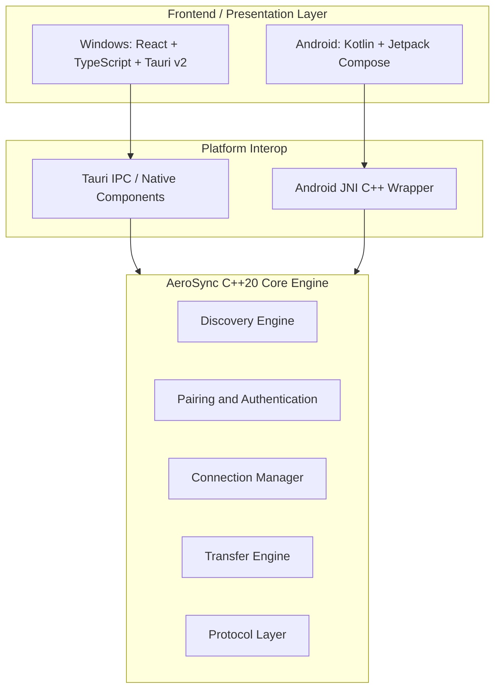

# AeroSync — High-Speed Cross-Platform File Transfer

<div align="center">


### High-speed peer-to-peer file sharing between Windows and Android over local Wi-Fi or Hotspot.

**Zero Cloud • Zero Compression • Direct Local Transfer**

---

[](https://github.com/Atulsain011/Aero_sync/releases/latest)
[](https://github.com/Atulsain011/Aero_sync/releases)
[](core/)
[](platform/windows/desktop_tauri)
[](LICENSE)

---

### Downloads

| Platform | Package | Download | Version |
| :--- | :--- | :--- | :--- |
| **Windows (Installer)** | `AeroSync-Setup-v1.0.5.exe` | [**Download Windows Installer (Recommended)**](https://github.com/Atulsain011/Aero_sync/releases/latest/download/AeroSync-Setup-v1.0.5.exe) | `v1.0.5` |
| **Windows (Portable)** | `AeroSync-Windows-Portable.zip` | [Download Windows Portable (.zip)](https://github.com/Atulsain011/Aero_sync/releases/latest/download/AeroSync-Windows-Portable.zip) | `v1.0.5` |
| **Windows (Standalone)** | `AeroSync.exe` | [Download Windows Executable](https://github.com/Atulsain011/Aero_sync/releases/latest/download/AeroSync.exe) | `v1.0.5` |
| **Android 8.0+** | `AeroSync.apk` | [**Download Android APK**](https://github.com/Atulsain011/Aero_sync/releases/latest/download/AeroSync.apk) | `v1.0.5` |
| All Releases | GitHub Releases | [Browse All Releases](https://github.com/Atulsain011/Aero_sync/releases) | `Latest` |

<br>

[](https://github.com/Atulsain011/Aero_sync/releases/latest/download/AeroSync-Setup-v1.0.5.exe)
  
[](https://github.com/Atulsain011/Aero_sync/releases/latest/download/AeroSync.apk)

</div>

---

## Overview

AeroSync is a peer-to-peer file transfer application designed for fast file sharing between Windows PCs and Android devices over a local Wi-Fi network or mobile hotspot.

Files are transferred directly between connected devices without requiring cloud storage or an external file-transfer server.

The project combines a native C++20 transfer engine with platform-specific interfaces for Windows and Android.

```text
+-------------------+          Local Wi-Fi / Hotspot          +-------------------+
|                   | <=====================================> |                   |
|    Windows PC     |           Direct File Transfer          |   Android Device  |
|                   |                                         |                   |
| Tauri + React UI  |                                         | Jetpack Compose   |
| C++20 Core Engine |                                         | JNI + C++ Engine  |
+-------------------+                                         +-------------------+
```

---

## Why AeroSync?

Traditional file-transfer methods can involve cloud uploads, internet bandwidth, Bluetooth limitations, or third-party services.

AeroSync is designed around direct local communication:

* No cloud storage required
* No external transfer server required
* Works over local Wi-Fi
* Works through mobile hotspots
* Designed for large files and folders
* Direct device-to-device communication
* Native C++ transfer engine
* Windows and Android support

---

## Key Features

### High-Speed Local Transfer

AeroSync is optimized for high-throughput file transfers over local networks, making it suitable for large videos, archives, software packages, backups, and folders.

Actual transfer performance depends on the Wi-Fi hardware, network configuration, device capabilities, storage performance, and transfer direction.

### Automatic Device Discovery

Nearby AeroSync devices can be discovered over the local network using network discovery mechanisms such as UDP-based discovery.

The goal is to minimize manual IP-address configuration.

### Device Pairing

AeroSync provides device pairing before allowing transfers.

Pairing can be implemented using mechanisms such as:

* PIN-based pairing
* QR-based connection
* User confirmation

### File and Folder Transfer

AeroSync supports transferring:

* Individual files
* Multiple files
* Large files
* Folders
* Nested directory structures

Transfer integrity can be verified using checksums where supported by the implementation.

### Windows Desktop Application

The Windows client uses:

* React
* TypeScript
* Tauri v2
* Rust
* Native C++ components

### Android Application

The Android client uses:

* Kotlin
* Jetpack Compose
* Material 3
* JNI
* Native C++ components

### Local Network Operation

AeroSync is designed to work without requiring an internet connection.

Both devices can communicate through:

* The same Wi-Fi network
* A phone hotspot
* A local access point

---

## System Architecture



---

## Technology Stack

| Component             | Technology              |
| :-------------------- | :---------------------- |
| Windows UI            | React, TypeScript       |
| Desktop Framework     | Tauri v2                |
| Desktop Runtime       | Rust                    |
| Core Engine           | C++20                   |
| Android UI            | Kotlin, Jetpack Compose |
| Android Native Layer  | JNI + C++               |
| Network Communication | TCP/UDP                 |
| Build System          | CMake, Gradle, Cargo    |
| Android Build         | Gradle                  |
| Windows Build         | CMake + Tauri           |
| Version Control       | Git                     |

---

## Quick Start

### Windows

1. Download the latest `AeroSync.exe` from the [GitHub Releases](https://github.com/Atulsain011/Aero_sync/releases) page.
2. Run `AeroSync.exe`.
3. If Windows SmartScreen displays a warning for an unsigned application, review the publisher information before proceeding.
4. Allow network access through Windows Firewall when prompted.
5. Connect the Windows PC and Android device to the same local network.

### Android

1. Download the latest `AeroSync.apk` from the [GitHub Releases](https://github.com/Atulsain011/Aero_sync/releases) page.
2. Install the APK on the Android device.
3. If required, enable installation from the selected source under Android's "Install unknown apps" settings.
4. Grant the permissions requested by the application.
5. Connect the Android device and Windows PC to the same Wi-Fi network or use a mobile hotspot.
6. Open AeroSync on both devices.
7. Pair the devices and begin transferring files.

---

## Building From Source

### Prerequisites

#### Windows

* Windows 10 or Windows 11
* CMake 3.22+
* Ninja
* MSVC 2022+ or Clang/LLVM
* Rust 1.80+
* Node.js 18+
* npm

#### Android

* Android Studio
* Android SDK
* Android API 34
* Android NDK 25.1+
* JDK 17+
* Gradle 8.10+

---

## Unified Build

AeroSync provides a unified PowerShell build script for the project.

```powershell
.\build_all.ps1
```

---

## Windows Native Build

Build the native Windows components with CMake:

```powershell
cmake -B build_windows -S platform/windows -G "Ninja" -DCMAKE_BUILD_TYPE=Release
cmake --build build_windows
```

---

## Windows Desktop Build

Navigate to the Tauri application:

```powershell
cd platform/windows/desktop_tauri
```

Install dependencies:

```powershell
npm install
```

Build the application:

```powershell
npm run build
```

For a release build:

```powershell
cargo build --release
```

---

## Android Build

Navigate to the Android project:

```powershell
cd platform/android
```

Build the debug APK:

```powershell
.\gradlew assembleDebug
```

The generated APK is expected at:

```text
platform/android/app/build/outputs/apk/debug/app-debug.apk
```

For a release APK, configure the appropriate signing configuration and build variant before distributing the application.

---

## Repository Structure

```text
AeroSync/
├── core/
│   ├── include/
│   │   └── aerosync/
│   └── src/
│
├── proto/
│   └── aerosync.proto
│
├── platform/
│   ├── windows/
│   │   ├── desktop_tauri/
│   │   ├── src/
│   │   └── installer_firewall_rule.ps1
│   │
│   └── android/
│       └── app/
│           └── src/
│               ├── main/
│               └── cpp/
│
├── tests/
│
├── build_all.ps1
├── Start_AeroSync_Desktop.bat
├── LICENSE
└── README.md
```

---

## Performance

AeroSync is designed for high-speed local-network file transfers.

Actual throughput depends on several factors:

* Wi-Fi generation and channel width
* Access-point or hotspot implementation
* Signal strength
* Device hardware
* CPU utilization
* Storage read/write speed
* TCP/UDP configuration
* Network congestion
* Transfer direction

For accurate performance reporting, benchmark results should be measured using the same devices, network configuration, file sizes, and transfer direction.

Example benchmark format:

| Test | Network         | File Size | Direction         | Speed |
| :--- | :-------------- | :-------- | :---------------- | :---- |
| 1    | Wi-Fi / Hotspot | 1 GB      | Android → Windows | TBD   |
| 2    | Wi-Fi / Hotspot | 1 GB      | Windows → Android | TBD   |
| 3    | Wi-Fi / Hotspot | 5 GB      | Android → Windows | TBD   |
| 4    | Wi-Fi / Hotspot | 5 GB      | Windows → Android | TBD   |

Replace `TBD` with measured results before publishing performance claims.

---

## Security and Privacy

AeroSync is designed around local peer-to-peer communication.

### Local Transfers

File data is intended to remain between the participating devices rather than being uploaded to a cloud storage service.

### Device Pairing

Devices should be paired before transfers are initiated.

### Data Integrity

Transfer integrity can be verified using checksums implemented by the transfer protocol.

### No Required Cloud Storage

AeroSync does not require a cloud storage account for local file transfers.

> Security guarantees depend on the exact implementation, network environment, pairing mechanism, and cryptographic protections enabled in the current release.

---

## Release Downloads

Official application binaries are distributed through GitHub Releases.

Latest release:

[View AeroSync Releases](https://github.com/Atulsain011/Aero_sync/releases)

Expected release assets:

```text
AeroSync.exe
AeroSync.apk
```

The direct download links in this README use the GitHub Releases `latest` asset URLs:

```text
https://github.com/Atulsain011/Aero_sync/releases/latest/download/AeroSync.exe
https://github.com/Atulsain011/Aero_sync/releases/latest/download/AeroSync.apk
```

These links will work once the corresponding files are uploaded as assets to a GitHub Release.

---

## Development

Contributions, bug reports, performance testing, and technical feedback are welcome.

Before submitting changes:

1. Build the affected platform.
2. Test the transfer workflow.
3. Verify device discovery.
4. Test both transfer directions.
5. Test large files.
6. Check for data-integrity issues.
7. Document significant changes.

---

## License

This project is licensed under the MIT License.

See [LICENSE](LICENSE) for details.

---

<div align="center">

Crafted by [Atul Kumar](https://github.com/Atulsain011)

If you find AeroSync useful, consider giving the repository a star.

</div>
